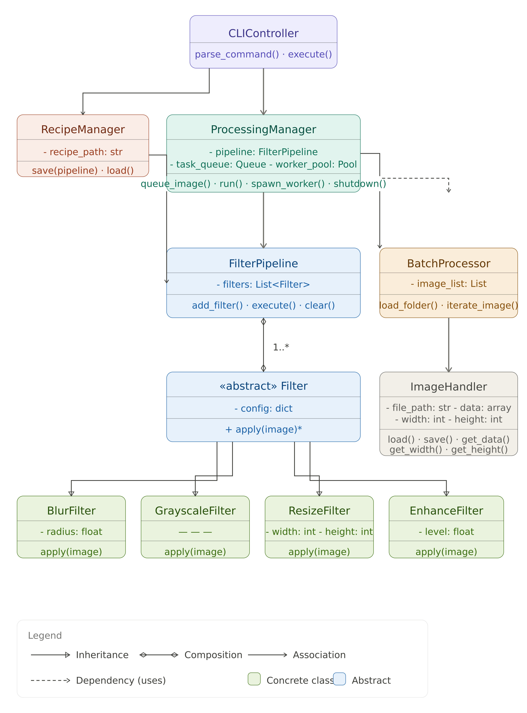
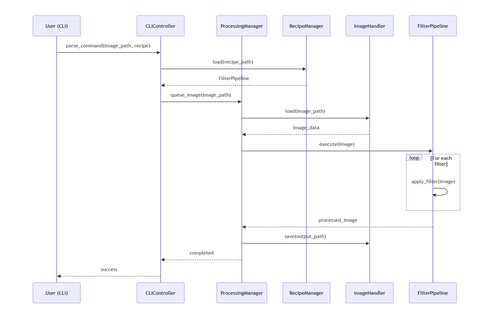
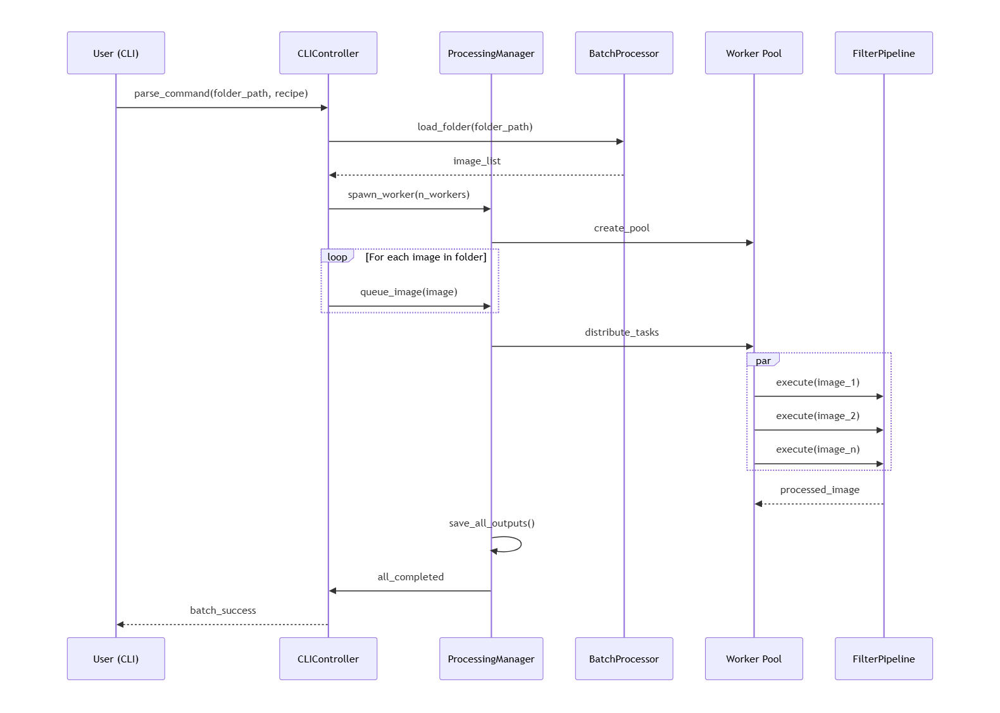
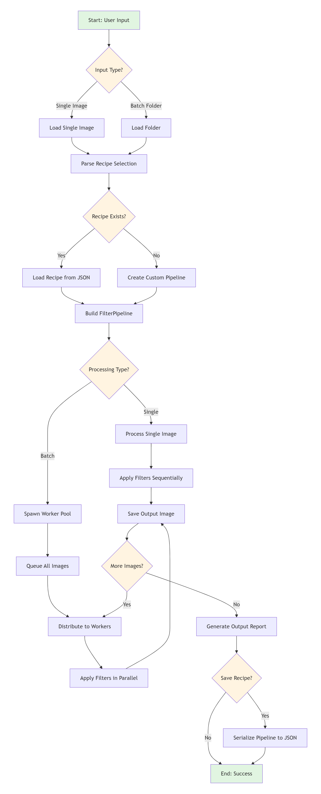

# Object Oriented Analysis(OOA),Object Oriented Design(OOD) and UML Diagram for Image-toolkit project

Image-Toolkit: Project Description
---------------------------------------
Image-Toolkit is a command-line Python application that loads image files, applies a configurable pipeline of image filters (blur, grayscale, resize, enhance, etc.), and saves the processed output. It is designed to handle single images and batch folders, support user-defined "filter recipes" saved as JSON, and process large workloads efficiently using multiprocessing.

Part: 01/ Object Oriented Analysis(OOA)
=======================================
## Actors
Actors are external entities that interact with the system:
* **User (CLI User)**: executes commands and provides necessary inputs (image path, recipe, and output location).
* **File System**: acts as the source for raw images and the destination for processed outputs.
* **JSON Recipe Storage**: stores reusable filter configurations and predefined processing logic.
* **OS/CPU Scheduler**: manages and executes the multiprocessing workers responsible for image processing.

## Use Case Analysis

### Use Case 1: Process Single Image
* User provides image path + filters/recipe
* System loads image
* Applies filter pipeline
* Saves output

### Use Case 2: Apply Recipe
* User selects a saved JSON recipe
* System reconstructs pipeline
* Applies filters in defined sequence

### Use Case 3: Batch Processing
* User provides folder path
* System loads all images
* Queues images
* Processes in parallel
* Saves outputs with naming strategy

### Use Case 4: Create / Save Recipe
* User defines filter sequence
* System serializes pipeline -> JSON

### Use Case 5: Load Recipe
* System deserializes JSON -> pipeline

## Domain Modeling
### Objects and Responsibilities
| Object | Responsibility |
| :--- | :--- |
| **Image** | Represents a single image and its pixel data. |
| **Filter** | Represents a transformation applied to an image. |
| **Filter Pipeline** | An ordered sequence of filters. |
| **Recipe** | Persisted configuration of a pipeline. |
| **Batch** | A collection of images sourced from a folder. |
| **Processing Unit (Worker)** | Executes the actual processing tasks. |
| **Processing Manager** | Coordinates the execution of pipelines across multiple images. |

### Conceptual relationships between them
* **Pipeline & Filters**: A **Pipeline** acts as a container for multiple **Filters**, defining their execution order.
* **Recipe & Pipeline**: A **Recipe** is the serialized description/template used to instantiate a **Pipeline**.
* **Batch & Images**: A **Batch** represents a logical grouping of multiple **Images** for bulk processing.
* **Processing Manager Coordination**: The **Processing Manager** serves as the central orchestrator, managing the interaction between:
    * **Images**: the data to be processed.
    * **Pipelines**: the logic to be applied.
    * **Workers**: the computational resources executing the tasks.

Part: 02/ Object Oriented Design(OOD)
=======================================
## Class specification

###  Core classes
**ImageHandler**
* Attribute: file_path, data, width, height
* Method: load(), save(output_path), get_data()

**Filter(Abstract base class)**
* Attribute: config
* Method: apply(image)

* **Concrete Filters**
* BlurFilter(radius)
* GrayscaleFilter
* ResizeFilter(width, height)
* EnhanceFilter(level)
* each implements, apply(image) method

**FilterPipeline**
* Attribute: filters: List[Filter]
* Method: add_filter(), execute(), clear()

**RecipeManager**
* Attribute: recipe_path
* Method: save(pipeline), load()--> FilterPipeline

**BatchProcessor**
* Attribute: image_list
* Method: load_folder(path), iterate_image()

**ProcessingManager** 
* Attributes: pipeline, task_queue, worker_pool
* Method: queue_image(image), run(), spawn_worker(n), shutdown()

**CLIController**
* Method: parse_command(), execute()

Part 3: UML Design Flow
========================

## 3.1 Class Diagram

The class diagram illustrates the structure of the Image-Toolkit system, showing all classes, their attributes, methods, and relationships:

### Key Relationships:
- **Inheritance**: Concrete filter classes (BlurFilter, GrayscaleFilter, etc.) inherit from abstract Filter base class
- **Composition**: FilterPipeline contains multiple Filter objects (aggregation relationship)
- **Association**: ProcessingManager uses FilterPipeline, BatchProcessor, and ImageHandler
- **Dependency**: CLIController depends on ProcessingManager and RecipeManager for coordination

## 3.2 Sequence Diagram: Single Image Processing (Use Case 1)

Illustrates the flow when user processes a single image with a recipe:

### Flow Steps:
1. User provides image path and recipe name via CLI
2. CLIController retrieves recipe from RecipeManager
3. ProcessingManager loads and queues the image
4. ImageHandler loads the image data into memory
5. FilterPipeline applies filters sequentially
6. Processed image is saved to output location

## 3.3 Sequence Diagram: Batch Processing (Use Case 3)

Illustrates parallel processing workflow for batch image processing:

### Flow Steps:
1. User specifies folder path containing images
2. BatchProcessor scans and loads all image paths
3. ProcessingManager initializes worker pool with n workers
4. All images are queued for processing
5. Worker pool distributes tasks across available CPU cores (multiprocessing)
6. Filters execute in parallel on different images
7. All processed outputs are saved with consistent naming
8. User receives completion confirmation

## 3.4 Design Pattern Summary

| Pattern | Usage | Classes Involved |
| :--- | :--- | :--- |
| **Factory Pattern** | Creates appropriate Filter instances | Filter, FilterPipeline |
| **Strategy Pattern** | Different filter strategies interchangeable | Filter (abstract), Concrete Filters |
| **Pipeline Pattern** | Sequential processing of filters | FilterPipeline, Filter |
| **Template Method** | Base Filter defines apply() contract | Filter base class |
| **Repository Pattern** | Manages recipe persistence | RecipeManager |
| **Observer/Publisher-Subscriber** | Status updates during processing | ProcessingManager |

## 3.5 Activity Diagram: Processing Workflow

Shows the overall flow of the Image-Toolkit system with decision points, branches, and process iterations:

### Key Activity Points:
- **Input Branch**: Handles both single image and batch folder inputs
- **Recipe Branch**: Determines if recipe is loaded from JSON or created on-the-fly
- **Processing Branch**: Single image uses sequential filter application; Batch uses parallel multiprocessing
- **Loop**: Continues processing for remaining images in batch
- **Recipe Save**: Option to persist the filter pipeline for future reuse

## 3.6 Component/Package Diagram: System Architecture

Illustrates the layered architecture and dependencies between system components:

### Architecture Layers:

**1. UI/CLI Layer**
- Entry point for user interaction
- CLIController: Parses commands and orchestrates execution
- Communicates with Processing and Data layers

**2. Processing Layer**
- Core business logic for image transformation
- **ProcessingManager**: Coordinates all processing tasks
- **BatchProcessor**: Manages batch image loading and iteration
- **FilterPipeline**: Manages filter sequencing and execution
- **Filter Components**: Concrete filter implementations
- Handles both sequential and parallel execution strategies

**3. Data/IO Layer**
- Abstraction for data access and persistence
- **ImageHandler**: Manages image file I/O and pixel data
- **RecipeManager**: Handles recipe serialization/deserialization
- Isolates business logic from storage details

**4. External Resources**
- File System: Source of images and output destination
- JSON Storage: Persistence for reusable filter recipes

### Design Benefits:
- **Separation of Concerns**: Each layer has distinct responsibilities
- **Maintainability**: Changes to I/O don't affect processing logic
- **Testability**: Layers can be tested independently
- **Scalability**: Easy to add new filters or storage backends
- **Reusability**: Components can be used in different contexts

