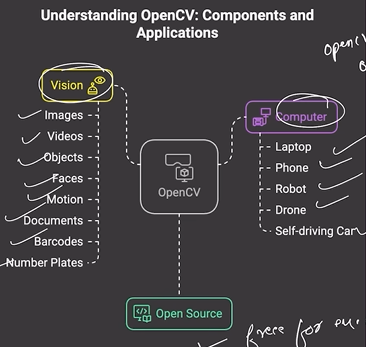

# Birth of OpenCV reason

1. Coding Difficulty: The challange of writting image processing code
2. Performance issues: The slow speed of image processing tasks
3. Lack of standardization: The absence of a unified library for image processing

# Game changing solutions after OpenCV

1. Easy to use functions: Functions that are simple and require no complex setup
2. Lightning fast performance: Solutions that operate at high speed and efficiency
3. Open sources standard: A standard that is free and accessible to all users

# The birth of openCV: A visionary journey

- 1999 : OpenCV invented by Gary Bradski at Intel Research labs
- 2000 : Official release of OpenCV the public

# The evaluation of OpenCV: From Garage to Global

- 2000 - Launched by intel(basic tools)
- 2005 - Adopted in research labs and top universities
- 2010 - Became industry standard (used in phones, factories, satellites)
- 2015 - Added support for AI and Deep learning
- 2020+ - Used in self driving cars, face recognition, AR filters, Drones, smart cities

# Understanding OpenCV: Components and Applications

# Benefits of Learning OpenCV
1. Job readiness: OpenCV skills prepare individuals for AI and data roles
2. Resume Enhancement: OpenCV skills are highly valued in AI/ML job applications.
3. Industry Relevance: OpenCV is used across various sectors, including startups and research.

 