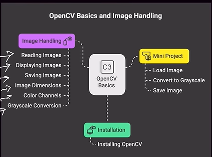

# OpenCV Basics and Image Handling



## Basic Terms
- Image : 2d matrix
- Pixel : matrix value smallest unit of image
- Width and Height: Width->Total number of pixel horizontally how much
Height -> Total number of pixel vertically how much
- Color Channels : Grayscale 1 channel(black and white) & RGB 3 channel(Red Green Blue), BGR 3 channel(Red Green Blue)
- Image Format: .jpg(small size low quality), .png(high quality), .bmp(uncompressed raw picture ), .tiff(super high resolution use scientific medical use)

### image read function - imread()
```
image = cv2.imread("filename.jpg", flag)

here flag = 0 means grayscale image load
     flag = 1 means colorful image load(default)
     flag = -1 unchanged
```

### image showing or display function - imshow(), waitkey(), destroyAllWindow()
```
cv2.imshow("window title", image) # open window 
cv2.waitkey(0) # wait for a key
cv2.destroyAllWindow() # close the window
```

### image saving function - imwrite()
```
cv2.imwrite("Output.jpg", image)
```

### image dimension attribute - .shape = shows height, width,color channel
```
h, w, c = image.shape
```

### grayscale conversion function - cvtColor()
```
gray = cv2.cvtColor(image location, cv2.COLOR_BGR2GRAY)
```