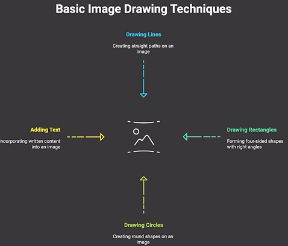

# Basic Image Drawing Techniques



## Drawing a line - cv2.line()
```
cv2.line(img, point1, point2, color, thickness)
```
## Drawing a rectangle - cv2.rectangle()
```
cv2.rectangle(img, point1, point2, color, thickness)
```
point1  = top left corner(x1,y1)
point2 =  bottom right corner(x2,y2)

## Drawing a circle - cv2.circle()
```
cv2.circle(img, center, radius, color, thickness)
```
## Addding text - cv2.putText()
```
cv2.putText(img, text, org, font, fontScale, color, thickness)
```