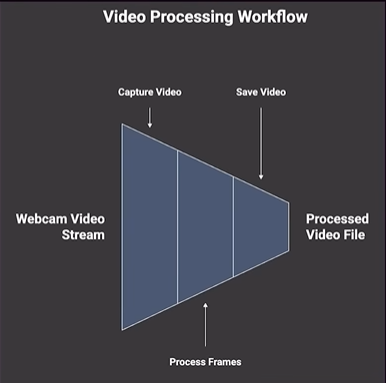

# Video Processing Workflow


## What is video?
Video is a sequence of images shown quickly to create motion. Each image is called a frame.
- A standard video shows 24 to 30 frames every second.
- When frames change fast enough, the eye sees smooth movement.

## What is a webcam?
A webcam is a small camera that captures live video and sends it to a computer in real time.
- It is often used for video calls, recording, and computer vision tasks.
- The computer can read frames directly from the webcam stream.

## Frame-by-frame processing
Video is processed one frame at a time. This means each image is analyzed or changed before moving to the next frame.
- Each frame is a still image that can be resized, filtered, or scanned.
- This method makes it easier to detect objects, track motion, or apply effects.
- After processing, frames are usually displayed again in order to show continuous video.

## Reading video from a source
To open a video or camera stream in OpenCV, use:
```
cap = cv2.VideoCapture(source)
```
- For the built-in laptop webcam, use `source = 0`.
- For an external webcam, use `source = 1` (or another device index if needed).

## Saving webcam video to a file (OpenCV)

### Overview
Save live camera video by reading frames from a capture device and writing them with a `cv2.VideoWriter` object.

### Key functions
- `cv2.VideoCapture(source)` — open camera or video file.
- `cv2.VideoWriter(filename, fourcc, fps, frame_size)` — save frames to a file.

### Example (record webcam)
```python
import cv2

cap = cv2.VideoCapture(0)  # 0 = built-in webcam, 1 = external
fourcc = cv2.VideoWriter_fourcc(*'XVID')
out = cv2.VideoWriter('output.avi', fourcc, 20.0, (640, 480))

while cap.isOpened():
    ret, frame = cap.read()
    if not ret:
        break
    # OPTIONAL: process frame (draw shapes, detect objects, etc.)
    out.write(frame)            # save the frame to file
    cv2.imshow('Recording', frame)
    if cv2.waitKey(1) & 0xFF == ord('q'):
        break

cap.release()
out.release()
cv2.destroyAllWindows()
```

### Steps (frame-by-frame)
1. Open the capture device (`VideoCapture`).
2. Configure output: codec (fourcc), `fps`, and `frame_size`.
3. Read frames in a loop, process each frame if needed, and write with `VideoWriter`.
4. Stop on user input (e.g., press `'q'`) and release resources (`release()`).

### Parameters explained
- `fourcc`: 4-character code for codec (e.g., `'XVID'`, `'MJPG'`, `'MP4V'`). Use `cv2.VideoWriter_fourcc` to create it.
- `fps`: frames per second (e.g., 20.0 or 30.0).
- `frame_size`: tuple `(width, height)` matching frames written.

### Notes
- Common container formats: `.avi` (widely supported) and `.mp4` (better compression; requires compatible codec).
- Ensure `frame_size` matches the frame shape; otherwise frames may be ignored or resized.
- While recording you can draw shapes, run detectors, or track objects before writing each frame.

