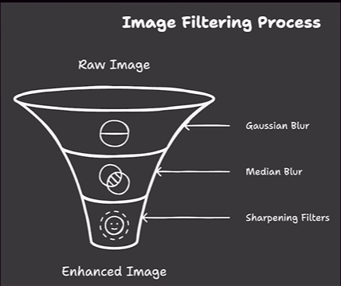
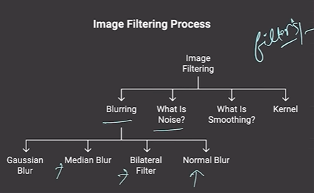
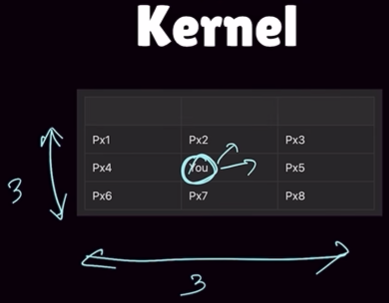

# Image Filtering process




# Gaussian Blur

```
blurred_image = cv2.GaussianBlur(image, (kernel_size_x, kernel_size_y), sigma)
```

### What is Gaussian Blur?

Gaussian blur is a type of image smoothing. It makes the image look softer by mixing each pixel with its neighbours using a bell-shaped (Gaussian) weight. This reduces small noise and fine detail.

### Why use it?

- Remove noise before doing other image tasks (for example, edge detection).
- Make an image look smoother and less sharp.
- Reduce small details that may get in the way of processing.

### When to use it?

- Before edge detectors (like `cv2.Canny`) to reduce false edges.
- Before resizing or downsampling to avoid aliasing.
- When you want a gentle blur for visual effect or background smoothing.

### Code syntax explained (very simple)

- `image`: the input image (grayscale or color).
- `(kernel_size_x, kernel_size_y)`: the kernel size. Use odd numbers like (3,3), (5,5), (7,7).
- `sigma`: standard deviation of the Gaussian. Use `0` to let OpenCV pick a good value.

Example:

```
blur = cv2.GaussianBlur(image, (5,5), 0)
```

This makes a slightly blurred image using a 5×5 kernel. Bigger kernels give stronger blur.

Tips:

- Use odd kernel sizes only.
- Larger kernel -> stronger blur.
- You can pass different `sigmaX` and `sigmaY` values for horizontal/vertical blur when needed.

## Kernel
### What is a kernel?

A kernel (also called a filter or mask) is a small 2D array of numbers. In image processing, kernels are used to change each pixel by looking at its neighbours.

### How it works (simple steps)

1. Put the kernel on top of the image so the kernel center is above one pixel.
2. Multiply each kernel number by the image pixel below it.
3. Add up all the multiplied values.
4. The result becomes the new value for the center pixel in the output image.
5. Move the kernel to the next pixel and repeat until the whole image is processed.

This process is called convolution (or filtering).

### Example kernels (what they do)

- Box blur (3×3): all ones, then divide by 9 — makes a simple blur.
- Sharpen:

	[ [0, -1, 0],
		[-1, 5, -1],
		[0, -1, 0] ] — makes edges and details clearer.
- Edge detection (Sobel X):

	[ [-1, 0, 1],
		[-2, 0, 2],
		[-1, 0, 1] ] — finds vertical edges.

### Kernel size and choices

- Use odd sizes like 3, 5, 7 so the kernel has a clear center.
- Bigger kernels affect a larger area and give stronger blur or smoothing.
- If kernel values add to more than 1, divide (normalize) to avoid changing image brightness.

### How to use with OpenCV (very simple)

- You can make a kernel with NumPy and apply it with `cv2.filter2D`.

Example:

```
import numpy as np
import cv2

kernel = np.ones((3,3), np.float32) / 9
out = cv2.filter2D(image, -1, kernel)
```

- For Gaussian blur, use `cv2.GaussianBlur` which builds a Gaussian kernel for you.
- Many kernels are separable (you can do a horizontal then vertical pass) to make the operation faster.

### Quick tips

- Always use odd kernel sizes.
- Try small kernels first (3×3), then increase if needed.
- Choose kernels based on your goal: blur, sharpen, or detect edges.


# Median Blur

```
blurred = cv2.medianBlur(image, kernel_size)
```

### What is Median Blur?

Median blur replaces each pixel with the median (middle) value of the pixels in a small neighbourhood around it. It is a non-linear filter — it does not use weighted sums like Gaussian blur.

### Why use it?

- It is very good at removing salt-and-pepper noise (random white and black pixels).
- It keeps edges sharper than a box blur because the median does not create new intermediate values.

### Quick tip:

- Use median blur when the image has salt-and-pepper noise; use Gaussian blur for general smoothing or Gaussian-shaped noise.


# Sharpening

```
cv2.filter2D(src, ddepth, kernel)
```

### What is sharpening?

Sharpening makes an image look clearer and more detailed. It increases edge contrast so lines and shapes stand out more.

### Why use it?

- To make objects and edges look more visible.
- To restore detail after blurring or soft focus.
- To make an image look more crisp for analysis.

### How it works (simple)

- A sharpening kernel has a strong center value and negative values around it.
- This highlights the difference between a pixel and its neighbours.
- The result makes edges brighter and flat areas stay similar.

### Example kernel

```
[ [0, -1, 0],
  [-1, 5, -1],
  [0, -1, 0] ]
```

### Simple use with OpenCV

- `src`: input image.
- `ddepth`: output depth, usually `-1` to keep same type.
- `kernel`: the sharpening mask.

Example:

```
kernel = np.array([[0, -1, 0],
                   [-1, 5, -1],
                   [0, -1, 0]], dtype=np.float32)
sharpened = cv2.filter2D(image, -1, kernel)
```

### Quick tip:

- Use sharpening when you want more defined edges and details.
- Avoid too much sharpening, or the image can look noisy.
