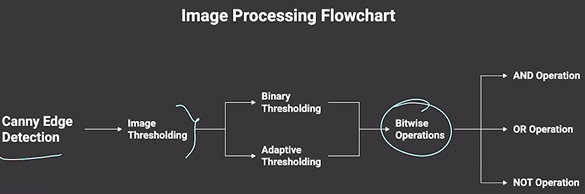

# Image processing process


## Canny Edge Detection

### What is it?

Canny Edge Detection finds edges (boundaries) in images. It detects where colors change sharply.

### Why use it?

- Find object boundaries
- Detect lines and shapes
- Prepare image for further analysis

### Simple Code

```python
import cv2

image = cv2.imread('photo.jpg', cv2.IMREAD_GRAYSCALE)
edges = cv2.Canny(image, 100, 200)

cv2.imshow('Edges', edges)
cv2.waitKey(0)
```

### Two Important Settings

**threshold1 = 100** (Lower Threshold)
- Edges weaker than this are removed
- Too high → miss real edges
- Too low → get noise

**threshold2 = 200** (Upper Threshold)
- Edges stronger than this are kept
- Usually 2-3 times bigger than threshold1
- Too high → broken edges
- Too low → too much noise

---

## Image Thresholding

### Binary Thresholding

#### What is it?

Convert grayscale image to black and white only. If pixel is bright → white (255). If dark → black (0).

#### Simple Rule

```
If pixel > 127 → make it white (255)
If pixel ≤ 127 → make it black (0)
```

#### Code

```python
import cv2

image = cv2.imread('photo.jpg', cv2.IMREAD_GRAYSCALE)
ret, binary = cv2.threshold(image, 127, 255, cv2.THRESH_BINARY)

cv2.imshow('Binary', binary)
cv2.waitKey(0)
```

#### When to use

- Documents (scan papers, books)
- Finding coins or objects
- High contrast images

#### Problem

- Doesn't work well with shadows
- Fixed number doesn't fit all images

---

### Adaptive Thresholding

#### What is it?

Instead of one threshold for whole image, use different thresholds for each small area. Smarter than binary.

#### How it works

1. Look at small square around each pixel (like 11×11)
2. Find average brightness of that square
3. Compare pixel to that average
4. Subtract a small number (C) from average to adjust

#### Code

```python
import cv2

image = cv2.imread('photo.jpg', cv2.IMREAD_GRAYSCALE)
adaptive = cv2.adaptiveThreshold(image, 255, 
                                 cv2.ADAPTIVE_THRESH_MEAN_C, 
                                 cv2.THRESH_BINARY, 
                                 blockSize=11, 
                                 C=2)

cv2.imshow('Adaptive', adaptive)
cv2.waitKey(0)
```

#### Settings

**blockSize = 11**
- Size of neighborhood square (must be odd number)
- Bigger = smoother, handles shadows better
- Smaller = keeps more details

**C = 2**
- Adjustment value (usually 2-10)
- Bigger C = more white pixels
- Smaller C = more black pixels

#### When to use

- Images with shadows
- Uneven lighting
- Photos with dark and bright areas

#### Why better than Binary

| | Binary | Adaptive |
|---|---|---|
| Speed | Fast | Slower |
| Shadows | Bad | Good |
| Lighting | Must be even | Works with uneven |
| Easy? | Yes | A bit harder |

---

## Bitwise Operations

### AND Operation

#### What is it?

Compare two images pixel by pixel. Keep pixels white only where BOTH images are white.

#### Simple Rule

```
White & White = White
White & Black = Black
Black & Black = Black
```

#### What it does

Result is white only in overlap areas. Used to mask (hide) parts of image.

#### Code

```python
import cv2

image1 = cv2.imread('photo1.jpg', cv2.IMREAD_GRAYSCALE)
image2 = cv2.imread('photo2.jpg', cv2.IMREAD_GRAYSCALE)

result = cv2.bitwise_and(image1, image2)

cv2.imshow('AND Result', result)
cv2.waitKey(0)
```

#### Common use

- Extract part of image using mask
- Keep only matching regions
- Find intersection of two detections

---

### OR Operation

#### What is it?

Compare two images. Result is white where AT LEAST ONE image is white.

#### Simple Rule

```
White | White = White
White | Black = White
Black | Black = Black
```

#### What it does

Result is white in combined area. Used to merge or combine images.

#### Code

```python
import cv2

image1 = cv2.imread('photo1.jpg', cv2.IMREAD_GRAYSCALE)
image2 = cv2.imread('photo2.jpg', cv2.IMREAD_GRAYSCALE)

result = cv2.bitwise_or(image1, image2)

cv2.imshow('OR Result', result)
cv2.waitKey(0)
```

#### Common use

- Combine two masks
- Merge detections from different methods
- Union of regions

---

### NOT Operation

#### What is it?

Flip colors. White becomes black, black becomes white.

#### Simple Rule

```
White (255) → Black (0)
Black (0) → White (255)
Gray → Opposite gray
```

#### What it does

Creates negative/inverse of image.

#### Code

```python
import cv2

image = cv2.imread('photo.jpg', cv2.IMREAD_GRAYSCALE)

inverted = cv2.bitwise_not(image)

cv2.imshow('NOT Result', inverted)
cv2.waitKey(0)
```

#### Common use

- Flip mask (find opposite area)
- Get background instead of foreground
- Invert colors

---

## Quick Comparison

| Operation | Result | Use |
|---|---|---|
| AND | Both white → white | Extract masked area |
| OR | Either white → white | Combine/merge areas |
| NOT | Flip colors | Invert mask |

---

## Summary

- **Canny**: Find edges with two threshold numbers
- **Binary**: Simple black/white, but bad with shadows
- **Adaptive**: Smart black/white, handles shadows
- **AND**: Keep overlap only
- **OR**: Combine areas
- **NOT**: Flip colors