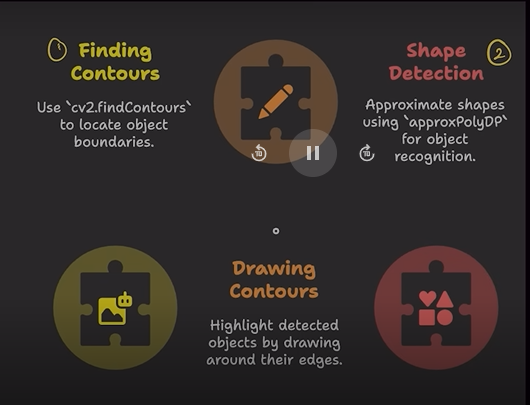
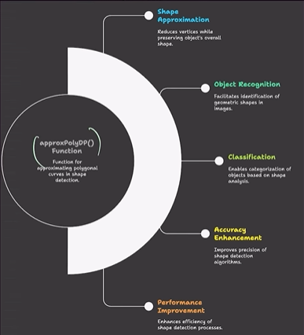

# Finding contours, Drawing contours on images, Shape detection using approxPolyDP

## Basic introduction
- **Contours** are continuous curves that trace the boundary of an object in an image.
- **Drawing contours on images** helps visualize object outlines and verify the detected shapes.
- **Shape detection** uses contour approximation and geometric properties to identify simple shapes like triangles, rectangles, and circles.
- **Object recognition basics** often begin with contour extraction; once contours are found, you can analyze shape, area, and hierarchy to recognize objects.



# Finding & Drawing Contours in OpenCV
```
contours, hierarchy = cv2.findContours(image, mode, method)
```
- `image`: usually a binary image (for example, thresholded or edge-detected)
- `mode`: contour retrieval mode
  1. `cv2.RETR_EXTERNAL` - returns only the outermost contours
  2. `cv2.RETR_LIST` - returns all contours without establishing any hierarchical relationships
  3. `cv2.RETR_TREE` - returns all contours and reconstructs the full hierarchy
- `method`: contour approximation method
  - `cv2.CHAIN_APPROX_NONE` - stores all contour points
  - `cv2.CHAIN_APPROX_SIMPLE` - compresses horizontal, vertical, and diagonal segments to endpoints
- `contours`: list of contours found in the image
- `hierarchy`: information about the image topology and contour relationships

```
cv2.drawContours(img, contours, contour_index, color, thickness)
```
- `img`: destination image on which contours are drawn
- `contours`: list of contour points returned by `cv2.findContours`
- `contour_index`: index of the contour to draw, or `-1` to draw all contours
- `color`: contour line color, e.g. `(0, 255, 0)` for green
- `thickness`: line thickness in pixels; use `-1` to fill the contour


## ApproxPolyDP() Function



```
approx = cv2.approxPolyDP(contour, epsilon, True)
```

- **What it does:** Approximates a contour with a simpler polygon using the Ramer–Douglas–Peucker algorithm; reduces number of points while preserving shape.
- **Signature:** `cv2.approxPolyDP(curve, epsilon, closed)` — returns an approximated contour (array of points).
- **Parameters:** **curve:** contour (Nx1x2 or Nx2 array); **epsilon:** maximum distance (float) between the original curve and its approximation; **closed:** bool (True for closed contours).
- **Choosing epsilon:** Scale with contour perimeter: `epsilon = k * cv2.arcLength(curve, True)`; typical `k` in `0.01–0.05`. Smaller → tighter fit; larger → stronger simplification.
- **Return:** NumPy array of polygon vertices (same point-format as input contour).
- **Common uses:** Shape detection (e.g., triangles when `len==3`, quadrilaterals when `len==4`), noise reduction, simplifying contours for matching or classification.
- **Practical tips:** Use `cv2.arcLength()` to set `epsilon` relative to size; after approximation, check `len(approx)` and optionally verify angles or aspect ratio to classify shapes.

**Example:**
```
cnt = contours[i]
epsilon = 0.02 * cv2.arcLength(cnt, True)
approx = cv2.approxPolyDP(cnt, epsilon, True)
if len(approx) == 3:
  shape = 'triangle'
elif len(approx) == 4:
  # further check for rectangle/square by angle/aspect
  shape = 'quadrilateral'
else:
  shape = 'circle-like/other'
```

Use this approximation together with area checks (`cv2.contourArea`) and bounding boxes (`cv2.boundingRect`) for more robust detection.

```
for contour in contours:
    approx = cv2.approxPolyDP(contour, 0.01 * cv2.arcLength(contour, True), True)

    corners = len(approx)
    if corners == 3:
        shape_name = 'Triangle'
    elif corners == 4:
        shape_name = 'Quadrilateral'
    elif corners > 4:
        shape_name = 'Circle'
    else:
        shape_name = 'Unknown'
    
    cv2.drawContours(img, [approx], 0, (255, 0, 0), 2)
    x = approx.ravel()[0]
    y = approx.ravel()[1] - 10
    cv2.putText(img, shape_name, (x, y), cv2.FONT_HERSHEY_SIMPLEX, 0.5, (255, 0, 0), 2)

cv2.imshow('Shapes', img)
cv2.waitKey(0)  
cv2.destroyAllWindows()

```
### 1. **`for contour in contours:`**
- Loop through each shape found in the image
- `contour` = one shape's boundary points
---
 
### 2. **`cv2.approxPolyDP(contour, 0.01 * cv2.arcLength(contour, True), True)`**
- **What it does:** Simplifies the shape by removing extra points
- **`cv2.arcLength(contour, True)`** = finds the perimeter (length around the shape)
- **`0.01 *`** = take 1% of the perimeter (controls how much detail to keep)
  - Small number = more detail kept
  - Big number = shape becomes simpler
- **`True`** = the shape is closed (connects back to start)
- **Returns:** `approx` = simplified shape with fewer corner points
---
 
### 3. **`corners = len(approx)`**
- Count how many corners the shape has
- More corners = more complex shape
---
 
### 4. **`if corners == 3: shape_name = 'Triangle'`**
- If 3 corners → it's a **Triangle**
- If 4 corners → it's a **Quadrilateral** (square or rectangle)
- If more than 4 corners → it's a **Circle** or complex shape
- Otherwise → **Unknown** shape
---
 
### 5. **`cv2.drawContours(img, [approx], 0, (255, 0, 0), 2)`**
- Draw the shape outline on the image
- `[approx]` = the simplified shape to draw
- `0` = draw the first shape
- `(255, 0, 0)` = blue color (in OpenCV, colors are BGR not RGB)
- `2` = line thickness (2 pixels wide)
---
 
### 6. **`x = approx.ravel()[0]`**
- `ravel()` = flatten the shape data into a single line
- `[0]` = get the first x-coordinate (leftmost point)
- This is where we put the text label
---
 
### 7. **`y = approx.ravel()[1] - 10`**
- Get the first y-coordinate
- `- 10` = move text 10 pixels UP (so it doesn't overlap the shape)
---
 
### 8. **`cv2.putText(img, shape_name, (x, y), cv2.FONT_HERSHEY_SIMPLEX, 0.5, (255, 0, 0), 2)`**
- Write the shape name on the image
- `shape_name` = text to write ("Triangle", "Circle", etc.)
- `(x, y)` = where to place the text
- `0.5` = size of text (smaller number = smaller text)
- `(255, 0, 0)` = blue color
- `2` = text thickness
---
 
### 9. **`cv2.imshow('Shapes', img)`**
- Show the image with all shapes and labels
- `'Shapes'` = window title
---
 
### 10. **`cv2.waitKey(0)`**
- Wait for user to press any key
- `0` = wait forever (no time limit)
---
 
### 11. **`cv2.destroyAllWindows()`**
- Close all windows when user presses a key
---
 
## Summary (One Sentence Each)
 
| Step | What Happens |
|------|-------------|
| Find contours | Find all shape outlines in image |
| Simplify shape | Remove extra points to make shape simpler |
| Count corners | Count how many corners = shape type |
| Classify | Decide if it's triangle, square, circle, etc. |
| Draw | Draw the shape outline on image in blue |
| Label | Write the shape name on top of the shape |
| Show | Display everything to user |
 
---
 
## Key Parameters to Remember
 
**epsilon** = How much detail to keep (smaller = more detail)
- `0.01` = keep lots of detail
- `0.05` = very simple shape
**corners** = Number of angles/corners
- 3 = Triangle
- 4 = Square/Rectangle
- 5+ = Circle or many-sided shape
**color** = (B, G, R) format - NOT RGB!
- (255, 0, 0) = Blue
- (0, 255, 0) = Green
- (0, 0, 255) = Red
**thickness** = line width in pixels
- 2 = thin line
- 5 = thick line
- -1 = fill the whole shape
---
 
## Real Example
If you have this image:
- A red triangle
- A blue square  
- A yellow circle
The code will:
1. Find all 3 shapes
2. Simplify each shape
3. Count corners (3, 4, 5+)
4. Write "Triangle", "Quadrilateral", "Circle" labels
5. Show everything on screen with blue outlines