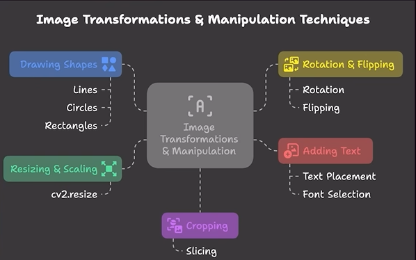

# Image Transformation and Manipulation Techniques



## Resizing and Scaling Images - cv2.resize()
```
resized = cv2.resize(src, dimensionsize, fx, fy, interpolation)
```
## Cropping Images using Slicing in OpenCV
```
cropped_img = image[startY:endY, startX:endX]
```

## Image rotation and flipping
Rotation
```
M = cv2.getRotationMatrix2D(center, angle, scale)
rotated_image = cv2.wrapAffine(image, M, (width, height))
```

Flipping
```
flipped = cv2.flip(image, flipped)
```
flipped = 0 means vertically flip
flipped = 1 means horizontally
flipped = -1 means both vertically and horizontally